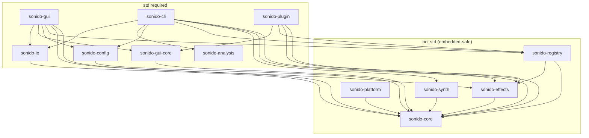

# Sonido

Production-grade DSP framework in Rust for audio effects, plugins, and embedded systems.

[](https://github.com/ampactor-labs/sonido/actions/workflows/ci.yml)
[](LICENSE)
[](https://doc.rust-lang.org/edition-guide/)

Sonido is a 12-crate Rust workspace implementing 19 audio effects, a synthesis engine, spectral analysis tools, a real-time GUI, and 19 CLAP plugins — all built on a `no_std`-compatible core for embedded deployment on ARM targets like the Electrosmith Daisy Seed.

<!-- TODO: screenshot of GUI -->

## Quick Start

Sonido is not yet published to crates.io. Add it as a git dependency:

```toml
[dependencies]
sonido-core = { git = "https://github.com/ampactor-labs/sonido" }
sonido-effects = { git = "https://github.com/ampactor-labs/sonido" }
```

Process audio through an effect:

```rust
use sonido_core::Effect;
use sonido_effects::Distortion;

let mut distortion = Distortion::new(48000.0);
distortion.set_drive_db(15.0);
distortion.set_tone_db(3.0);

// Sample-by-sample
let output = distortion.process(input_sample);

// Block processing
distortion.process_block(&input_buffer, &mut output_buffer);
```

### Effect Chaining

```rust
use sonido_core::{Effect, EffectExt};
use sonido_effects::{Distortion, Chorus, Delay, Reverb};

// Zero-cost static dispatch (no heap allocation)
let mut chain = Distortion::new(48000.0)
    .chain(Chorus::new(48000.0))
    .chain(Delay::new(48000.0))
    .chain(Reverb::new(48000.0));

chain.process_block(&input, &mut output);
```

## Architecture



| Crate | Purpose | no_std |
|-------|---------|--------|
| `sonido-core` | Effect trait, parameters, delays, filters, LFOs, tempo, DAG processing graph | Yes |
| `sonido-effects` | 19 effect implementations | Yes |
| `sonido-synth` | PolyBLEP oscillators, ADSR envelopes, voice management, modulation matrix | Yes |
| `sonido-registry` | Effect factory and discovery by name/category | Yes |
| `sonido-platform` | Hardware abstraction: PlatformController, ControlMapper | Yes |
| `sonido-analysis` | FFT, spectral analysis, PAC/CFC, adaptive filters, resampling | No |
| `sonido-config` | Preset and chain configuration management | Partial |
| `sonido-io` | WAV I/O, real-time audio streaming via cpal | No |
| `sonido-gui-core` | Shared GUI widgets, theme, ParamBridge trait | No |
| `sonido-gui` | egui-based real-time effects GUI with preset management | No |
| `sonido-cli` | Command-line processor and analyzer | No |
| `sonido-plugin` | CLAP plugin adapter with embedded GUI | No |

## Effects (19)

| Effect | Category | True Stereo | Key Parameters |
|--------|----------|:-----------:|----------------|
| Preamp | Dynamics | | gain, tone |
| Compressor | Dynamics | | threshold, ratio, attack, release, knee, mix |
| Limiter | Dynamics | | threshold, release |
| Gate | Dynamics | | threshold, attack, release, hold |
| Distortion | Drive | | drive, tone, mode (soft/hard/fuzz/tube) |
| Tape Saturation | Drive | | drive, warmth, wow, flutter, head bump |
| Bitcrusher | Drive | | bit depth, sample rate reduction |
| Chorus | Modulation | x | rate, depth, mix, voices |
| Flanger | Modulation | x | rate, depth, feedback, mix |
| Phaser | Modulation | x | rate, depth, stages, feedback |
| Tremolo | Modulation | | rate, depth, waveform |
| MultiVibrato | Modulation | | rate, depth, voices |
| Ring Modulator | Modulation | | frequency, mix |
| Wah | Filter | | frequency, resonance, mode (manual/auto/envelope) |
| Filter | Filter | | cutoff, resonance, type (LP/HP/BP/notch) |
| Parametric EQ | Filter | | 3-band frequency, gain, Q |
| Delay | Time-Based | x | time, feedback, mix, ping-pong, diffusion |
| Reverb | Time-Based | x | room size, damping, width, mix |
| Stage | Utility | | phase invert, DC block, bass mono, output |

## CLI

```bash
# Install
cargo install --path crates/sonido-cli

# Process audio
sonido process input.wav --effect distortion --param drive=15
sonido process input.wav --chain "preamp:gain=6|distortion:drive=12|delay:time=300"
sonido process input.wav --preset presets/guitar_crunch.toml

# Real-time processing (live mic input)
sonido realtime --effect chorus --param rate=2 --param depth=0.6

# Generate test signals
sonido generate sweep sweep.wav --start 20 --end 20000 --duration 3.0
sonido generate tone tone.wav --freq 440 --duration 2.0
sonido generate noise noise.wav --duration 1.0 --amplitude 0.5

# Analyze audio
sonido analyze spectrum recording.wav --fft-size 4096 --peaks 10
sonido analyze transfer dry.wav wet.wav --output response.json
sonido analyze ir sweep.wav recorded.wav --output ir.wav

# List effects and devices
sonido effects
sonido devices
```

## CLAP Plugins

Sonido builds 19 CLAP audio plugins (one per effect), each with an embedded egui GUI. Compatible with Bitwig, Reaper, Ardour, and any CLAP-compatible DAW.

```bash
# Build and install all 19 plugins
make plugins

# Or manually
cargo build --release -p sonido-plugin --examples
mkdir -p ~/.clap
cp target/release/examples/libsonido_*.so ~/.clap/
```

Plugins: `sonido-preamp`, `sonido-distortion`, `sonido-compressor`, `sonido-gate`, `sonido-eq`, `sonido-wah`, `sonido-chorus`, `sonido-flanger`, `sonido-phaser`, `sonido-tremolo`, `sonido-delay`, `sonido-filter`, `sonido-multivibrato`, `sonido-tape`, `sonido-reverb`, `sonido-limiter`, `sonido-bitcrusher`, `sonido-ringmod`, `sonido-stage`

## Synthesis Engine

PolyBLEP-antialiased oscillators (sine, saw, square, triangle), ADSR envelopes with configurable curves, polyphonic voice management with voice stealing, and a modulation matrix for flexible source→destination routing.

```rust
use sonido_synth::{PolyphonicSynth, Waveform};

let mut synth = PolyphonicSynth::new(48000.0, 8); // 8 voices
synth.set_waveform(Waveform::Sawtooth);
synth.note_on(60, 0.8); // MIDI note 60, velocity 0.8
synth.process_block(&mut output_buffer);
```

See [docs/SYNTHESIS.md](docs/SYNTHESIS.md) for the full synthesis guide.

## Analysis Toolkit

FFT-based spectral analysis, transfer function measurement, impulse response extraction, phase-amplitude coupling (PAC) with comodulograms and surrogate statistics, adaptive filters (LMS/NLMS), cross-correlation, digital down-conversion, phase unwrapping, and polyphase resampling.

See [docs/BIOSIGNAL_ANALYSIS.md](docs/BIOSIGNAL_ANALYSIS.md) and [docs/CFC_ANALYSIS.md](docs/CFC_ANALYSIS.md).

## GUI

```bash
cargo run -p sonido-gui --release
```

The GUI provides drag-and-drop effect chain building, real-time input/output metering, per-effect knob controls with parameter-scale-aware mapping, preset save/load, and a dark theme optimized for studio use.

<!-- TODO: GUI screenshot -->

## Performance

Even on a 2015 mobile CPU (Intel Core i5-6300U @ 2.40 GHz), every effect runs well within real-time budget. Measured at block size 256 samples, 48 kHz:

| Effect | µs/block | ns/sample | CPU % (mono) |
|--------|----------|-----------|:------------:|
| Preamp | 2.2 | 9 | 0.04% |
| Filter | 3.4 | 13 | 0.06% |
| Delay | 3.1 | 12 | 0.06% |
| Tape Saturation | 6.7 | 26 | 0.13% |
| Distortion | 14.4 | 56 | 0.27% |
| Chorus | 20.4 | 80 | 0.38% |
| Compressor | 29.1 | 113 | 0.54% |
| Reverb | 44.5 | 174 | 0.83% |
| MultiVibrato | 73.4 | 287 | 1.38% |
| 5-effect chain | 42.8 | 167 | 0.80% |

CPU % = `ns_per_sample / (1e9 / 48000) × 100`. Run benchmarks via CI: `gh workflow run ci-manual.yml -f job=bench`

## Testing

1,300+ tests across the workspace:

- **Golden file regression**: Effect output compared against reference WAV files (MSE < 1e-6, SNR > 60 dB, spectral correlation > 0.9999)
- **Property-based testing**: Proptest verifies bounded output and reset behavior for all 19 effects
- **no_std verification**: 5 core crates tested without default features
- **Doc tests**: All rustdoc examples compile and run
- **CI**: 4 always-on jobs (lint, test, no_std, wasm) + 3 manual-dispatch (benchmarks, coverage, plugin validation)

```bash
cargo test                          # Full workspace
cargo test -p sonido-effects        # Single crate
cargo test --no-default-features -p sonido-core  # no_std
```

## Audio Demos

Demo files are generated locally, not checked into the repo:

```bash
./scripts/generate_demos.sh
```

This produces source tones (sine, sawtooth chord, percussive hit, sweep) and processed versions through each effect and a full 5-effect chain.

## Documentation

### Design & Theory
- [DSP Fundamentals](docs/DSP_FUNDAMENTALS.md) — signal processing theory behind the implementations
- [Design Decisions](docs/DESIGN_DECISIONS.md) — architecture decision records
- [Architecture Overview](docs/ARCHITECTURE.md) — crate structure and data flow
- [DSP Quality Standard](docs/DSP_QUALITY_STANDARD.md) — measurement protocol and compliance

### User Guides
- [Getting Started](docs/GETTING_STARTED.md)
- [CLI Guide](docs/CLI_GUIDE.md)
- [Effects Reference](docs/EFFECTS_REFERENCE.md)
- [Synthesis Guide](docs/SYNTHESIS.md)
- [GUI Documentation](docs/GUI.md)

### Specialized Topics
- [CFC/PAC Analysis Guide](docs/CFC_ANALYSIS.md)
- [Biosignal Analysis](docs/BIOSIGNAL_ANALYSIS.md)
- [Hardware Targets](docs/HARDWARE.md)
- [Daisy Seed Integration](docs/DAISY_SEED.md)

### Development
- [Contributing](docs/CONTRIBUTING.md)
- [Testing](docs/TESTING.md)
- [Benchmarks](docs/BENCHMARKS.md)
- [Changelog](docs/CHANGELOG.md)

## Commercial DSP Reference Analysis

Sonido's effect algorithms are informed by analysis of commercial DSP products. These are clean-room implementations — no proprietary code or firmware was used. The goal is to demonstrate deep understanding of production DSP architectures.

| Target Product | DSP Domain | Sonido Implementation |
|----------------|------------|----------------------|
| DigiTech Ventura / Modela | Modulation (chorus, vibrato, rotary) | `Chorus`, `MultiVibrato`, LFO engine |
| DigiTech Obscura | Delay (analog, tape, lo-fi modes) | `Delay` with feedback coloring, `TapeSaturation` |
| DigiTech Dirty Robot | Envelope-following filter / synth | `Wah` (auto-wah mode), `Filter`, synth engine |
| DigiTech Polara / Supernatural | Reverb (room, hall, plate, spring) | `Reverb` (Freeverb topology with stereo decorrelation) |

See `sonido compare` CLI command for A/B measurement between hardware captures and Sonido output.

## License

Sonido is licensed under [AGPL-3.0-or-later](LICENSE). A commercial license is available for proprietary integration (DAW plugins, embedded hardware, closed-source products). See [LICENSING.md](LICENSING.md) for details.
