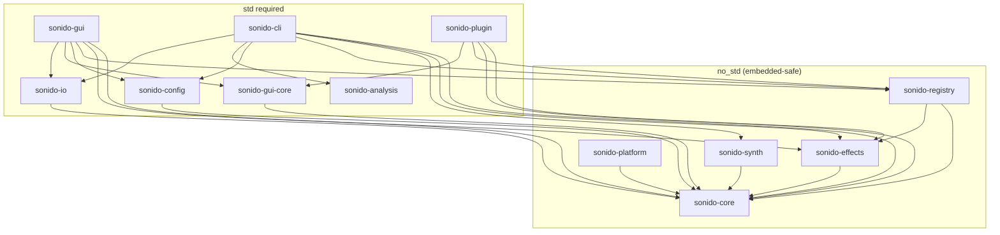

# Sonido

Production-grade DSP framework in Rust — 19 audio effects built on a three-layer kernel architecture that runs identically on desktop plugins, CLI tools, and bare-metal ARM (Cortex-M7). Six `no_std` crates, zero-heap audio paths, `libm` for all math, `from_knobs()` on every effect for direct ADC-to-parameter mapping.

[](https://github.com/ampactor-labs/sonido/actions/workflows/ci.yml)
[](LICENSE-MIT)
[](https://doc.rust-lang.org/edition-guide/)

14-crate Rust workspace: 19 effects, synthesis engine, spectral analysis, real-time GUI, 20 CLAP plugins — all from a shared `no_std` DSP core targeting Electrosmith Daisy Seed (STM32H750, 480 MHz Cortex-M7).

## Quick Start

Sonido is not yet published to crates.io. Add it as a git dependency:

```toml
[dependencies]
sonido-core = { git = "https://github.com/ampactor-labs/sonido" }
sonido-effects = { git = "https://github.com/ampactor-labs/sonido" }
```

### Embedded / Bare-Metal Path

Direct kernel access — no allocator, no smoothing overhead, no trait objects. The kernel receives typed parameters each sample and returns audio:

```rust
use sonido_effects::kernels::{DistortionKernel, DistortionParams};
use sonido_core::kernel::DspKernel;

let mut kernel = DistortionKernel::new(48000.0);

// from_knobs() maps 0.0–1.0 ADC readings → parameter ranges
let params = DistortionParams::from_knobs(
    adc_drive, adc_tone, adc_output, adc_shape, adc_mix,
);
let (out_l, out_r) = kernel.process_stereo(in_l, in_r, &params);
```

### Desktop / Plugin Path

The registry wraps every kernel in `KernelAdapter`, which adds per-parameter smoothing and bridges to `Effect` + `ParameterInfo`:

```rust
use sonido_registry::EffectRegistry;
use sonido_core::EffectWithParams;

let registry = EffectRegistry::new();
let mut effect = registry.create("distortion", 48000.0).unwrap();
effect.effect_set_param(0, 15.0);  // drive = 15 dB

let output = effect.process(input_sample);
```

### Effect Chaining

```rust
use sonido_registry::EffectRegistry;
use sonido_core::EffectWithParams;

let registry = EffectRegistry::new();
let mut chain: Vec<Box<dyn EffectWithParams + Send>> = vec![
    registry.create("distortion", 48000.0).unwrap(),
    registry.create("chorus", 48000.0).unwrap(),
    registry.create("reverb", 48000.0).unwrap(),
];
```

## Kernel Architecture

Every effect is implemented as a three-layer stack that separates pure DSP from parameter ownership:

```
┌─────────────────────────────────────────────────────────┐
│                   KernelAdapter<K>                       │
│  Bridges to Effect + ParameterInfo traits                │
│  Manages per-parameter SmoothedParam instances           │
│  Desktop / Plugin / GUI consumer                         │
├─────────────────────────────────────────────────────────┤
│                     XxxKernel                            │
│  Pure DSP state: filters, delay lines, ADAA stages       │
│  process_stereo(&mut self, l, r, &Params) → (l, r)      │
│  No parameter ownership — receives &Params each sample   │
│  Embedded / Bare-metal consumer                          │
├─────────────────────────────────────────────────────────┤
│                     XxxParams                            │
│  Typed parameter struct with indexed access               │
│  from_knobs() for ADC mapping, lerp() for morphing       │
│  from_normalized() / to_normalized() for CLAP/MIDI       │
│  Doubles as preset format, morph target, serialization   │
└─────────────────────────────────────────────────────────┘
```

**Why this matters for embedded**: The kernel never allocates, never owns parameters, and never smooths. On a Cortex-M7, your DMA audio callback calls `kernel.process_stereo()` with parameters constructed directly from ADC readings. The adapter layer — smoothing, trait dispatch, boxing — only exists on desktop where you can afford it.

### Anti-Aliasing

- **ADAA** (Anti-Derivative Anti-Aliasing): First-order ADAA on all nonlinear kernels (distortion, tape saturation). Reference: Parker et al., "Reducing the Aliasing of Nonlinear Waveshaping Using Continuous-Time Convolution" (DAFx-2016).
- **Oversampled\<N, E\> wrapper**: 2×/4×/8× oversampling with 48-tap FIR filter (>80 dB stopband rejection). Wraps any `Effect` — the inner effect runs at N× the base sample rate.

### Parameter Smoothing

`KernelAdapter` applies per-parameter smoothing based on `SmoothingStyle` declared by each `KernelParams`:

| Style | Time | Use Case |
|-------|------|----------|
| `None` | 0 ms | Stepped/enum params — snap immediately |
| `Fast` | 5 ms | Drive, nonlinear gain — fast response |
| `Standard` | 10 ms | Most continuous params (rate, depth, mix) |
| `Slow` | 20 ms | Filter coefficients, EQ bands |
| `Interpolated` | 50 ms | Delay time, predelay — glitch-free |
| `Custom(ms)` | arbitrary | Special cases |

The kernel never sees smoothing. On embedded, ADC readings are already hardware-filtered — smoothing is skipped entirely.

### Preset Morphing

All 19 `KernelParams` implement `lerp()` for real-time preset interpolation:

```rust
let blended = DistortionParams::lerp(&clean_preset, &heavy_preset, 0.5);
// Continuous params interpolate linearly; stepped params snap at t=0.5
```

### Algorithm References

| Algorithm | Reference |
|-----------|-----------|
| Biquad filters | Robert Bristow-Johnson, "Audio EQ Cookbook" |
| Freeverb topology | Jezar's Freeverb (Schroeder-Moorer) |
| ADAA waveshaping | Parker et al., DAFx-2016 |
| PolyBLEP anti-aliasing | Välimäki et al., "Antialiasing Oscillators in Subtractive Synthesis" |
| General effects | Zölzer, "DAFX: Digital Audio Effects" |

## Embedded Deployment

Target hardware: **Electrosmith Daisy Seed** (STM32H750, Cortex-M7 @ 480 MHz, 64 MB SDRAM) and **PedalPCB Hothouse** DIY pedal platform (6 knobs, 3 toggles, stereo I/O).

`no_std` across 6 crates (`sonido-core`, `sonido-effects`, `sonido-synth`, `sonido-registry`, `sonido-platform`, `sonido-daisy`). All math via `libm`. All 19 effects provide `from_knobs()` for direct 0.0–1.0 ADC-to-parameter mapping.

### DMA Audio Callback Example

```rust
use sonido_effects::kernels::{DistortionKernel, DistortionParams};
use sonido_core::kernel::DspKernel;

static mut KERNEL: Option<DistortionKernel> = None;

fn audio_callback(left_in: &[f32], right_in: &[f32],
                  left_out: &mut [f32], right_out: &mut [f32]) {
    let kernel = unsafe { KERNEL.as_mut().unwrap() };

    // Read ADC knobs once per block
    let params = DistortionParams::from_knobs(
        read_adc(0), read_adc(1), read_adc(2), read_adc(3), read_adc(4),
    );

    // Block processing — no allocation, no trait dispatch
    kernel.process_block_stereo(left_in, right_in, left_out, right_out, &params);
}
```

The `PlatformController` trait and `ControlMapper` in `sonido-platform` provide a structured abstraction for mapping hardware controls (knobs, toggles, expression pedals) to kernel parameters. See [docs/EMBEDDED.md](docs/EMBEDDED.md) for hardware integration details.

## Effects (19)

| Effect | Category | True Stereo | Key Parameters |
|--------|----------|:-----------:|----------------|
| Preamp | Utility | x | gain, tone |
| Distortion | Distortion | | drive, tone, mode (Soft Clip / Hard Clip / Foldback / Asymmetric) |
| Tape Saturation | Distortion | | drive, warmth, wow, flutter, head bump |
| Bitcrusher | Distortion | x | bit depth, sample rate reduction |
| Compressor | Dynamics | | threshold, ratio, attack, release, knee, mix |
| Limiter | Dynamics | x | threshold, release |
| Gate | Dynamics | | threshold, attack, release, hold |
| Chorus | Modulation | x | rate, depth, mix, voices |
| Flanger | Modulation | x | rate, depth, feedback, mix |
| Phaser | Modulation | x | rate, depth, stages, feedback |
| Tremolo | Modulation | x | rate, depth, waveform, stereo spread |
| Vibrato | Modulation | | depth, mix, output |
| Ring Modulator | Modulation | x | frequency, mix |
| Wah | Filter | | frequency, resonance, mode (Auto / Manual) |
| Filter | Filter | | cutoff, resonance (resonant biquad lowpass) |
| Parametric EQ | Filter | | 3-band frequency, gain, Q |
| Delay | Time-Based | x | time, feedback, mix, ping-pong, diffusion |
| Reverb | Time-Based | x | room size, damping, width, mix |
| Stage | Utility | x | phase invert, DC block, bass mono, width, Haas delay, output |

**Categories**: Distortion (3), Dynamics (3), Modulation (6), Filter (3), Time-Based (2), Utility (2).

## Processing Graph

DAG-based audio routing via `ProcessingGraph` and `GraphEngine`:

```rust
use sonido_core::graph::ProcessingGraph;

// Linear chain
let mut graph = ProcessingGraph::linear(effects, 48000.0, 256)?;
graph.process_block(&left_in, &right_in, &mut left_out, &mut right_out);

// Arbitrary DAG: parallel paths with split/merge
let mut graph = ProcessingGraph::new(48000.0, 256);
let input = graph.add_input();
let split = graph.add_split();
let a = graph.add_effect(distortion);
let b = graph.add_effect(reverb);
let merge = graph.add_merge();
let output = graph.add_output();

graph.connect(input, split)?;
graph.connect(split, a)?;
graph.connect(split, b)?;
graph.connect(a, merge)?;
graph.connect(b, merge)?;
graph.connect(merge, output)?;
graph.compile()?;  // Kahn sort → liveness analysis → latency compensation
```

- **Buffer liveness analysis**: Minimizes memory — a 20-node chain uses only 2 buffers
- **Latency compensation**: Auto-inserts delay lines on shorter parallel paths
- **Atomic schedule swap**: Compiled schedules swap via `Arc` with ~5ms crossfade (click-free)
- **Graph DSL**: `"preamp:gain=6 | distortion:drive=15 | reverb:mix=0.3"`
- **Parallel split**: `"split(distortion:drive=20; -) | limiter"` (dry path via `-`)

## Architecture


```mermaid
graph TD
    subgraph "no_std (embedded-safe)"
        core[sonido-core]
        effects[sonido-effects]
        synth[sonido-synth]
        registry[sonido-registry]
        platform[sonido-platform]
    end

    subgraph "std required"
        analysis[sonido-analysis]
        config[sonido-config]
        io[sonido-io]
        gui_core[sonido-gui-core]
        gui[sonido-gui]
        cli[sonido-cli]
        plugin[sonido-plugin]
    end

    effects --> core
    synth --> core
    registry --> core & effects
    platform --> core
    config --> core
    io --> core
    gui_core --> core
    gui --> core & effects & registry & config & gui_core & io
    cli --> core & effects & synth & registry & config & analysis & io
    plugin --> core & effects & registry & gui_core
```

| Crate | Purpose | no_std |
|-------|---------|--------|
| `sonido-core` | Effect trait, DspKernel/KernelParams/KernelAdapter, parameters, delays, filters, LFOs, tempo, DAG processing graph | Yes |
| `sonido-effects` | 19 effects via DspKernel + KernelAdapter architecture | Yes |
| `sonido-synth` | PolyBLEP oscillators, ADSR envelopes, voice management, modulation matrix | Yes |
| `sonido-registry` | Effect factory and discovery by name/category | Yes |
| `sonido-platform` | Hardware abstraction: PlatformController, ControlMapper | Yes |
| `sonido-analysis` | FFT, spectral analysis, adaptive filters, resampling | No |
| `sonido-config` | Preset and chain configuration management | Partial |
| `sonido-io` | WAV I/O, real-time audio streaming via cpal | No |
| `sonido-gui-core` | Shared GUI widgets, theme, ParamBridge trait | No |
| `sonido-gui` | egui-based real-time effects GUI with preset management | No |
| `sonido-cli` | Command-line processor and analyzer | No |
| `sonido-plugin` | CLAP plugin adapter with embedded GUI | No |

## CLAP Plugins

Sonido builds 20 CLAP audio plugins — one per effect plus a multi-effect chain plugin — each with an embedded egui GUI. Compatible with Bitwig, Reaper, Ardour, and any CLAP-compatible DAW.

```bash
# Build and install all plugins
make plugins
```

Plugins: `sonido-preamp`, `sonido-distortion`, `sonido-compressor`, `sonido-gate`, `sonido-eq`, `sonido-wah`, `sonido-chorus`, `sonido-flanger`, `sonido-phaser`, `sonido-tremolo`, `sonido-delay`, `sonido-filter`, `sonido-vibrato`, `sonido-tape`, `sonido-reverb`, `sonido-limiter`, `sonido-bitcrusher`, `sonido-ringmod`, `sonido-stage`, `sonido-chain`

`sonido-chain` is a 16-slot dynamic multi-effect: add, remove, and reorder effects without restarting the host. 512 pre-allocated CLAP parameters cover all slot combinations.

## Synthesis Engine

PolyBLEP-antialiased oscillators (sine, saw, square, triangle), ADSR envelopes with configurable curves, polyphonic voice management with voice stealing, and a modulation matrix for flexible source→destination routing.

```rust
use sonido_synth::{PolyphonicSynth, OscillatorWaveform};

let mut synth: PolyphonicSynth<8> = PolyphonicSynth::new(48000.0);
synth.set_osc1_waveform(OscillatorWaveform::Saw);
synth.note_on(60, 100);  // MIDI note C4, velocity 100
let sample = synth.process();
```

See [docs/SYNTHESIS.md](docs/SYNTHESIS.md) for the full synthesis guide.

## CLI

10 commands for processing, analysis, and real-time audio:

```bash
# Install
cargo install --path crates/sonido-cli

# Process audio
sonido process input.wav --effect distortion --param drive=15
sonido process input.wav --chain "preamp:gain=6|distortion:drive=12|delay:time=300"
sonido process input.wav --preset presets/guitar_crunch.toml

# Parallel split routing via graph DSL
sonido process input.wav --chain "split(distortion:drive=20; -) | limiter"

# Real-time processing (live mic input)
sonido realtime --effect chorus --param rate=2 --param depth=0.6

# Generate test signals
sonido generate sweep sweep.wav --start 20 --end 20000 --duration 3.0
sonido generate tone tone.wav --freq 440 --duration 2.0
sonido generate noise noise.wav --duration 1.0 --amplitude 0.5

# Analyze audio
sonido analyze spectrum recording.wav --fft-size 4096 --peaks 10
sonido analyze transfer dry.wav wet.wav --output response.json
sonido analyze ir sweep.wav recorded.wav --output ir.wav

# List effects and devices
sonido effects
sonido devices
```

## GUI

```bash
cargo run -p sonido-gui --release
```

The GUI provides drag-and-drop effect chain building, real-time input/output metering, per-effect knob controls with parameter-scale-aware mapping, preset save/load, and a dark theme optimized for studio use. Also builds to `wasm32-unknown-unknown` via Trunk for browser-based demos.

## Performance

Even on a 2015 mobile CPU (Intel Core i5-6300U @ 2.40 GHz), every effect runs well within real-time budget. Measured at block size 256 samples, 48 kHz:

| Effect | µs/block | ns/sample | CPU % (mono) |
|--------|----------|-----------|:------------:|
| Preamp | 2.2 | 9 | 0.04% |
| Filter | 3.4 | 13 | 0.06% |
| Delay | 3.1 | 12 | 0.06% |
| Tape Saturation | 6.7 | 26 | 0.13% |
| Distortion | 14.4 | 56 | 0.27% |
| Chorus | 20.4 | 80 | 0.38% |
| Compressor | 29.1 | 113 | 0.54% |
| Reverb | 44.5 | 174 | 0.83% |
| Vibrato | 73.4 | 287 | 1.38% |
| 5-effect chain | 42.8 | 167 | 0.80% |

CPU % = `ns_per_sample / (1e9 / 48000) × 100`. Measured on x86_64. Embedded ARM benchmarks pending (see [docs/EMBEDDED.md](docs/EMBEDDED.md) for memory budgets). Run benchmarks via CI: `gh workflow run ci-manual.yml -f job=bench`

## Testing

1,369 tests across the workspace:

- **Golden file regression**: Effect output compared against reference WAV files (MSE < 1e-6, SNR > 60 dB, spectral correlation > 0.9999)
- **Property-based testing**: Proptest verifies bounded output and reset behavior for all 19 effects
- **no_std verification**: 5 core crates tested without default features
- **Doc tests**: All rustdoc examples compile and run
- **Algorithm citations**: Every DSP implementation traces to a published reference (Bristow-Johnson Audio EQ Cookbook, Parker et al. DAFx-2016, Jezar Freeverb, Välimäki PolyBLEP, Zölzer DAFX)
- **CI**: 4 always-on jobs (lint, test, no_std, wasm) + 3 manual-dispatch (benchmarks, coverage, plugin validation)

```bash
cargo test                          # Full workspace
cargo test -p sonido-effects        # Single crate
cargo test --no-default-features -p sonido-core  # no_std
```

## Audio Demos

Demo files are generated locally, not checked into the repo:

```bash
./scripts/generate_demos.sh
```

This produces source tones (sine, sawtooth chord, percussive hit, sweep) and processed versions through each effect and a full 5-effect chain.

## Commercial DSP Reference

Effect algorithms are informed by clean-room analysis of commercial DSP hardware.

| Target Product | DSP Domain | Sonido Implementation |
|----------------|------------|----------------------|
| DigiTech Ventura / Modela | Modulation (chorus, vibrato, tremolo) | `Chorus`, `Vibrato`, `Tremolo`, LFO engine |
| DigiTech Obscura | Delay (analog, tape, lo-fi modes) | `Delay` with feedback coloring, `Tape` |
| DigiTech Dirty Robot | Envelope-following filter / synth | `Wah` (auto-wah mode), `Filter`, synth engine |
| DigiTech Polara / Supernatural | Reverb (room, hall, plate, spring) | `Reverb` (Freeverb topology with stereo decorrelation) |

## Documentation

### Design & Theory
- [DSP Fundamentals](docs/DSP_FUNDAMENTALS.md) — signal processing theory behind the implementations
- [Design Decisions](docs/DESIGN_DECISIONS.md) — architecture decision records
- [Architecture Overview](docs/ARCHITECTURE.md) — crate structure and data flow
- [DSP Quality Standard](docs/DSP_QUALITY_STANDARD.md) — measurement protocol and compliance

### User Guides
- [Getting Started](docs/GETTING_STARTED.md)
- [CLI Guide](docs/CLI_GUIDE.md)
- [Effects Reference](docs/EFFECTS_REFERENCE.md)
- [Synthesis Guide](docs/SYNTHESIS.md)
- [GUI Documentation](docs/GUI.md)
- [Embedded Guide](docs/EMBEDDED.md)

### Development
- [Contributing](docs/CONTRIBUTING.md)
- [Testing](docs/TESTING.md)
- [Benchmarks](docs/BENCHMARKS.md)
- [Changelog](docs/CHANGELOG.md)

## License

Sonido is dual-licensed under [MIT](LICENSE-MIT) or [Apache-2.0](LICENSE-APACHE), at your option. See [docs/LICENSING.md](docs/LICENSING.md) for the rationale.
